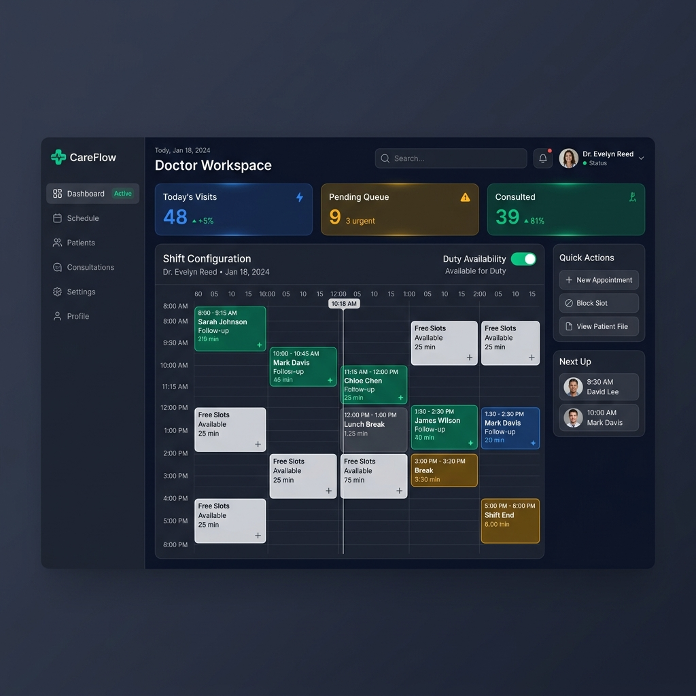
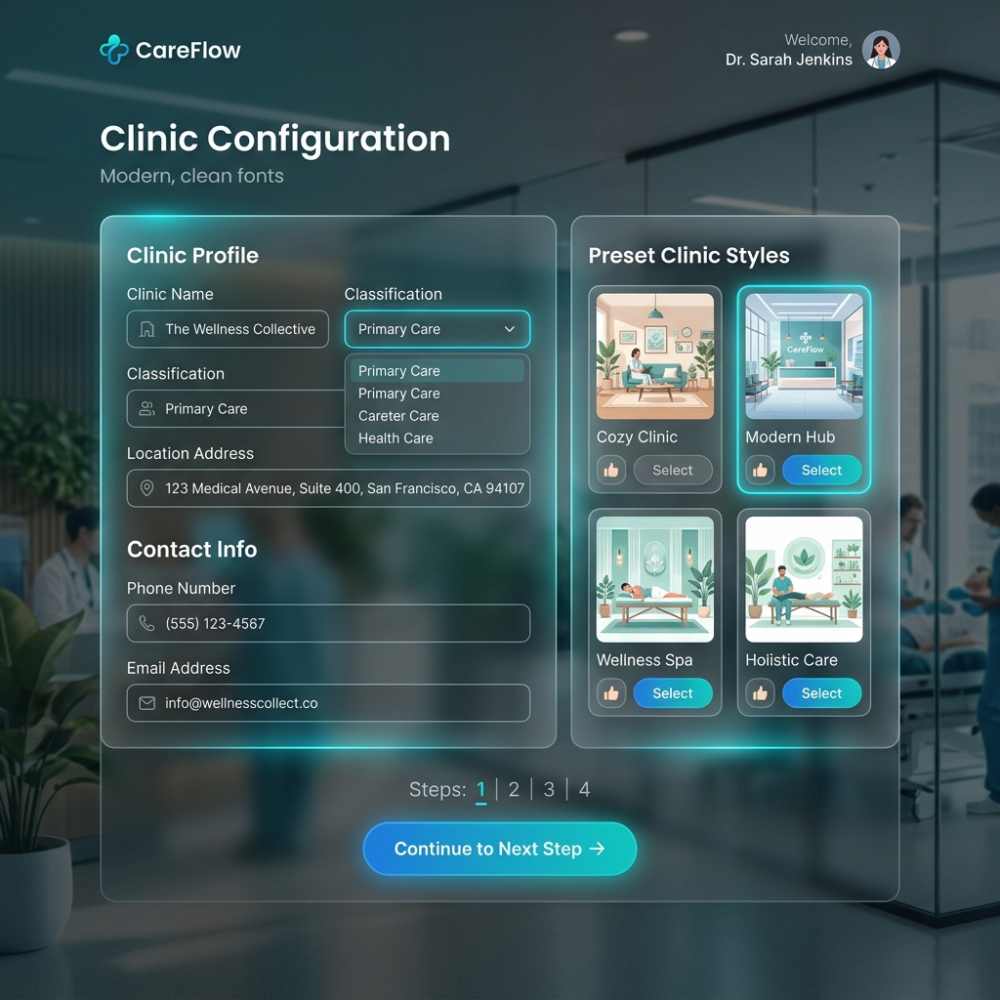
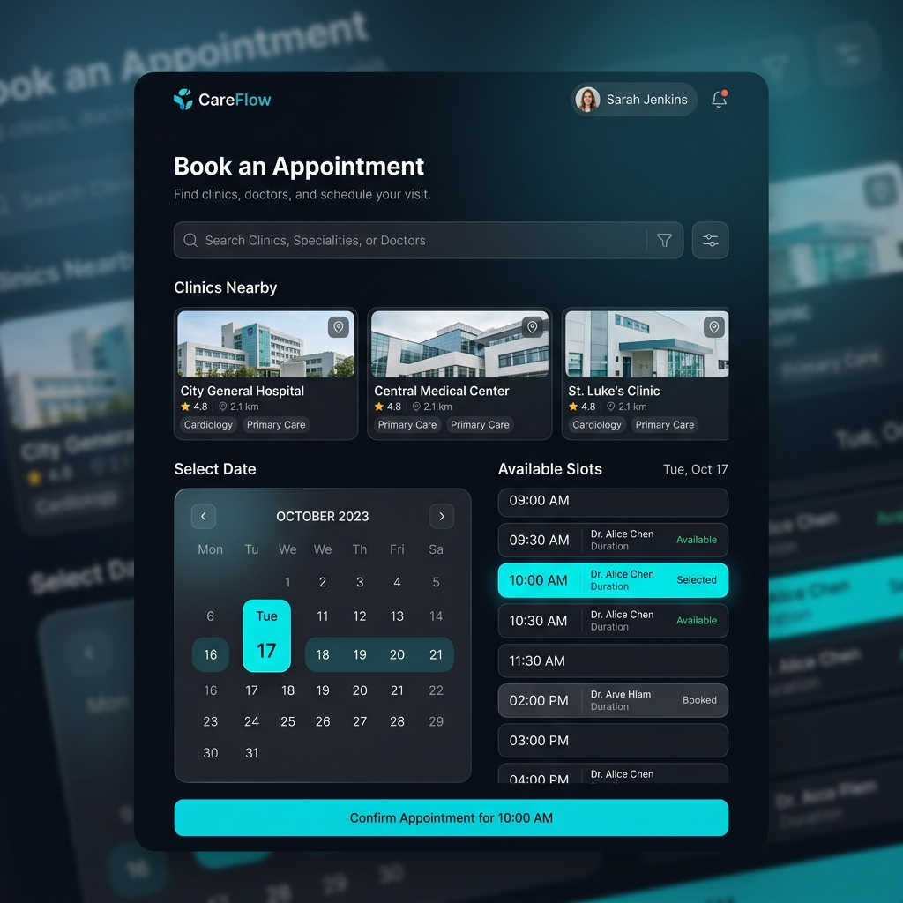
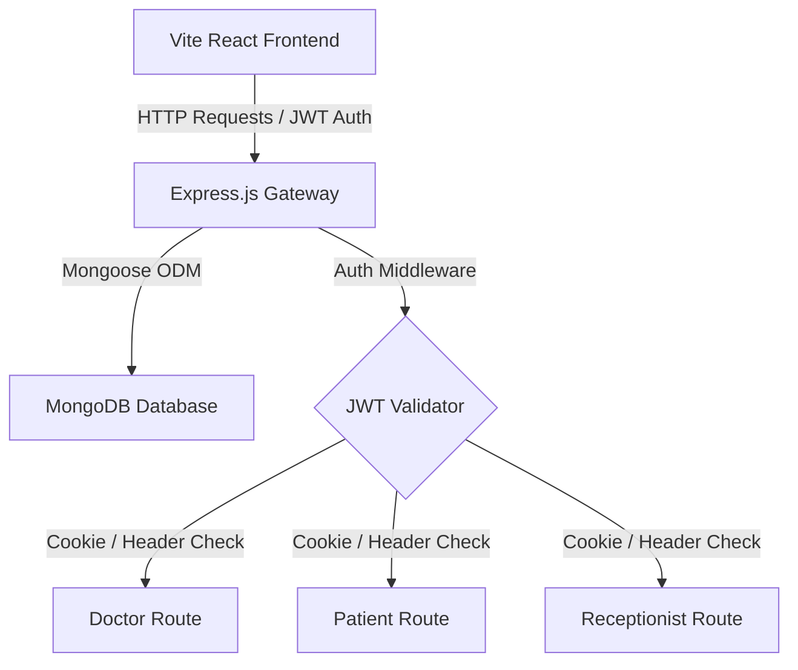

# 🏥 CareFlow — Enterprise Hospital & Clinic Workspace

CareFlow is a modern, high-performance, full-stack Hospital Management & Clinic Coordination System designed for seamless medical workflows. Built for physicians, patients, and receptionists, it optimizes scheduling, manages patient queues, and enables instant clinic custom configuration.

---

## 🌟 Visual Showcase

Here is a glimpse of the premium, glassmorphism-inspired dark-mode user interface designed to wow patients and practitioners alike:

### 1. Physician Workspace Dashboard
Doctors can view real-time statistics (Today's Visits, Pending Queue, Consultations), manage their availability, and interactively block breaks or reschedule slot allocations.



### 2. Custom Clinic Configuration Center
Allows medical practitioners to dynamically onboard new clinics, classifying them under public/private sectors, providing localized address configurations, and visual branding preset selections.



### 3. Patient Appointment Booking Portal
A beautiful user dashboard for patients to find local facilities, browse medical departments, select appointment dates, and secure real-time slot allocations.



---

## ⚡ Core Features

### 📅 Smart Daily Shift Planner
* **Dynamic Slot Durations**: Supports configurations from 10-minute quick consults to 60-minute in-depth sessions.
* **Break Management**: Doctors can block/unblock hourly slots in real-time.
* **Auto-Regenerate Scheduling**: Deletes and dynamically regenerates future free slots upon shift reconfiguration without disrupting booked patients.

### 🛡️ Dual-Layer Authentication
* **Seamless Cross-Origin Auth**: Uses a robust fallback logic checking both HTTP-Only Cookies and `Authorization: Bearer <token>` headers to bypass cross-origin third-party cookie blocks.
* **Role-Based Guards**: Strict, separated access controls for `Patient`, `Doctor`, and `Receptionist` roles.

### 🏢 Clinic / Hospital Registry
* **On-the-Fly Creation**: Dynamically register custom clinics during doctor sign-up.
* **Visual Branding**: Integrated preset illustration selection and custom image URL rendering.

### 🧑‍⚕️ Receptionist Dispatch Control
* **Walk-In Scheduling**: Register and assign walk-in physical patients directly onto open slot times.
* **Multi-Doctor Schedule Log**: Centralized dashboard to view availability and active status logs across the facility.

---

## 🛠️ Tech Stack & System Architecture



* **Frontend**: React.js (Vite), Framer Motion (Micro-animations), Lucide Icons, Vanilla CSS (Premium Tailored HSL Colors).
* **Backend**: Node.js, Express.js, JSON Web Tokens (JWT), Cookie-Parser, Bcrypt.js (Password Hashing).
* **Database**: MongoDB (Atlas cloud cluster) managed with Mongoose schemas.
* **DevOps**: Docker containers for microservice deployment using Multi-stage builds.

---

## 🚀 Setup & Local Execution

### Prerequisites
* [Node.js](https://nodejs.org/) (v16+ recommended)
* [MongoDB](https://www.mongodb.com/) (Local server or MongoDB Atlas URL)

### 1. Clone the Repository
```bash
git clone https://github.com/kiratjot-singh/CareFlow.git
cd CareFlow
```

### 2. Backend Setup
1. Navigate to the Backend folder:
   ```bash
   cd Backend
   ```
2. Install dependencies:
   ```bash
   npm install
   ```
3. Create a `.env` file in the `Backend` directory and define your environment variables:
   ```env
   PORT=5000
   MONGO_URI="your-mongodb-connection-string"
   JWT_SECRET="your-jwt-secret-key"
   CLIENT_URL="http://localhost:5173"
   ```
4. Run the server:
   ```bash
   node server.js
   ```

### 3. Frontend Setup
1. Open a new terminal in the root directory and run:
   ```bash
   cd Frontend
   ```
2. Install dependencies:
   ```bash
   npm install
   ```
3. Create a `.env` file in the `Frontend` directory:
   ```env
   VITE_API_BASE_URL="http://localhost:5000/api"
   ```
4. Run the development build:
   ```bash
   npm run dev
   ```

---

## 🐳 Docker Deployment

The application is fully containerized. To spin up the complete development environment (Frontend, Backend, and Agents):

```bash
docker-compose up --build
```
This runs the client on `http://localhost:5173` and backend API gateway on `http://localhost:5000`.

---

## 📄 License
This project is licensed under the ISC License.
